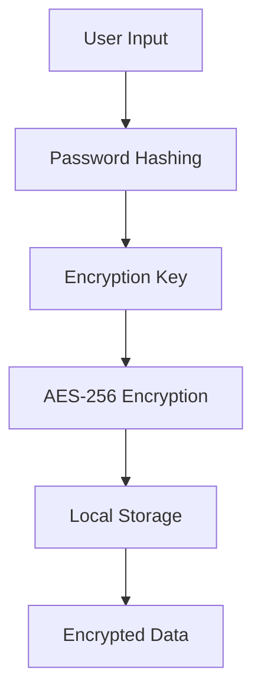

# Secure Notes Manager 🔒

 
 
 

A secure, encrypted note-taking web application that protects your sensitive notes with AES-256 encryption. Your data remains encrypted until you enter your master password.

## Features ✨

- **Military-Grade Encryption**: AES-256 encryption for all notes  
- **Master Password Protection**: Single password to rule them all  
- **Zero-Knowledge Architecture**: We never see your data  
- **Secure Client-Side Storage**: Notes encrypted before saving  
- **Password Strength Meter**: Visual feedback for strong passwords  
- **Note Categories**: Organize by work/personal/ideas  
- **Search Functionality**: Find notes instantly  

## Tech Stack 🛠️

| Component         | Technology     |
|------------------|----------------|
| Frontend         | React.js       |
| Encryption       | crypto-js (AES-256) |
| Routing          | React Router   |
| Password Hashing | SHA-256        |
| Styling          | CSS Modules    |

## Installation 💻

To get started with the project locally:

1. Clone the repository:
   ```bash
   git clone https://github.com/suriyaram15/secure-notes.git
   cd secure-notes
   ```

2. Install dependencies:
   ```bash
   npm install
   ```

3. Start the development server:
   ```bash
   npm run dev
   ```

4. Open your browser and navigate to:
   ```
   http://localhost:5173
   ```

> ⚠️ Make sure your screenshots are located in the `public/` directory in your repo for them to appear on GitHub.

## Security Architecture 🔐



## Usage Guide 📝

### First-Time Setup
1. Launch the app  
2. Create your master password  
3. Start adding secure notes  

### Adding a Note
1. Click "Add Note"  
2. Enter title and content  
3. Select category  
4. Click "Encrypt & Save"  

### Viewing Notes
1. Enter master password  
2. Search/filter notes as needed  
3. Notes auto-decrypt in memory  

## Security Notes ⚠️

- Your master password is **never stored** (only its hash)  
- If you lose the password, **your data is irrecoverable**  
- For maximum security:  
  - Use a strong master password  
  - Clear browser storage when done  
  - Don't use on public computers  

## Development Roadmap 🗺️

- [ ] Biometric authentication  
- [ ] Secure note sharing  
- [ ] Multi-device sync  
- [ ] Dark mode  
- [ ] Note expiration dates  

## Contributing 🤝

Pull requests welcome! Please:  
1. Fork the repository  
2. Create your feature branch  
3. Submit a PR with detailed explanation  

## License 📜

MIT License - see [LICENSE.md](LICENSE.md) for details

---

**Warning**: This is a client-side only application. For production use, consider adding server-side validation and backup mechanisms.
